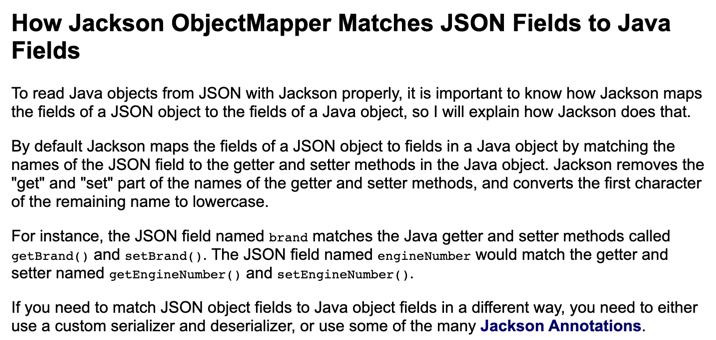

`@RequestParam`, `@RequestBody`, `@ModelAndAttribute` 세가지 annotation은 모두 request의 데이터를 받아오기 위해 사용됩니다.

# @RequestParam

공식 문서를 보면 RequestParam은 다음과 같이 설명합니다.

> For access to the Servlet request parameters(that is, query parameters or form data), including multipart files. Parameter values are converted to the declared method argument type.

이를 해석해보면 `RequestParam`은 Query Parameter나 form data 형식의 데이터들을 컨트롤러의 method argument로 변환을 해주는 어노테이션임을 알 수 있다.

해당 어노테이션은 어떻게 사용할까? RequestParam는 아래와 같이 컨트롤러 메서드의 파라미터에 붙여주면 파라미터 이름에 해당하는 Query Parameter의 값을 매핑해준다. 즉, 아래의 예시 코드는 `~/pet?petId=14` 로 요청이 왔을 때 컨트롤러 petId argument에 14라는 값이 매핑되게 된다.

```java
@Controller
@RequestMapping("/pets")
public class EditPetForm {

    // ...

    @GetMapping
    public String setupForm(@RequestParam("petId") int petId, Model model) {
        Pet pet = this.clinic.loadPet(petId);
        model.addAttribute("pet", pet);
        return "petForm";
    }

    // ...
}
```

- RqeustParam은 기본적으로 `required`옵션의 default값이 true라서 반드시 값이 전송되어야 한다. 만약 해당 값이 없다면 400 error가 발생하기에 필수가 아니도록 설정하려면 `required`값을 false로 설정하여야 한다.
- `defaultValue`옵션을 통해 값이 들어오지 않았을 때에 대한 default값도 설정 가능하다.
- argument의 타입을 array나 list로 선언하면 동일한 매개변수 이름에 대한 여러 값들이 저장된다.
- `@RequestParam` 이 붙은 매개변수에 특정한 이름이 없이 `Map<String, String>`, `MultiValueMap<String, String>` 으로 선언이 된다면, 넘어오는 값들로 해당 map이 채워진다.
- `@RequestParam`은 생략 가능하다.

  공식 문서에는 다음과 같이 나와있다.

  > Note that use of `@RequestParam` is optional (for example, to set its attributes). By default, any argument that is a simple value type (as determined by [BeanUtils#isSimpleProperty](https://docs.spring.io/spring-framework/docs/5.3.19/javadoc-api/org/springframework/beans/BeanUtils.html#isSimpleProperty-java.lang.Class-)) and is not resolved by any other argument resolver, is treated as if it were annotated with `@RequestParam`

  이를 해석해보자면 기본적으로 [BeanUtils#isSimpleProperty](https://docs.spring.io/spring-framework/docs/5.3.19/javadoc-api/org/springframework/beans/BeanUtils.html#isSimpleProperty-java.lang.Class-) 에게 결정되는 단순한 값 유형들은 다른 argument resolver(즉, 다른 api 메서드)에게 해석되지 않으면 해당 파라미터는 `@RequestParam`이 붙은 것처럼 다뤄지게 된다.

# @RequestBody

먼저 RequestBody도 공식 문서를 살펴보면 다음과 같이 설명한다.

> For access to the HTTP request body. Body content is converted to the declared method argument type by using `HttpMessageConverter`
>  implementations.

> You can use the `@RequestBody`annotation to have the request body read and deserialized into an `Object` through an HttpMessageConverter.

이를 해석해보면 어노테이션의 이름대로 Http request body의 값을 읽어오기 위해 사용되는데 이를 `HttpMessageConverter`를 통해 객체로 역직렬화해주는 것을 알 수 있다.

@RequestBody는 request의 body에 있는 Json(application/json)형태의 데이터를 Java 객체로 변환시켜준다. 아래의 예시 코드와 Http Request를 보도록 하자.

```java
public class SignUpRequestDto {

    private String email;
    private String name;
    private String password;

    public SignUpRequest() {
    }

    public String getEmail() {
        return email;
    }

    public String getName() {
        return name;
    }

    public String getPassword() {
        return password;
    }
}

@RestController
@RequestMapping("/api/members")
public class MemberController {
		@PostMapping
    @ResponseStatus(HttpStatus.CREATED)
    public void signUp(@RequestBody SignUpRequestDto request) {
        memberService.signUp(request.toServiceRequest());
    }
}
```

controller의 @RequestBody가 붙은 객체의 필드와 보면 email, name, password가 있는 것을 볼 수 있다. 여기에 아래의 요청이 간다면 해당 객체의 필드에 값들이 정상적으로 매핑된다

```
Request method:	POST
...
Content-Type=application/json
...
Body:
{
    "email": "rex@wooteco.com",
    "name": "렉스",
    "password": "Rex1!"
}
```

### DTO에는 어떤 메서드, 생성자가 필요하며 어떻게 매핑되는걸까?

RequestBody에 사용되는 DTO에는 기본 생성자와 getter메서드만 존재하여도 올바르게 매핑이 된다. 필드를 할당해주는 생성자나 setter가 없어도 이와 같이 매핑을 할 수 있는 이유는 @RequestBody가 JSON 데이터를 객체로 반환할 때 Spring에 등록되어있는 Jackson라이브러리의 `MappingJackson2HttpMessageConverter`를 사용하여 역직렬화를 하기 때문이다. 해당 메서드는 내부적으로 ObjectMapper를 사용해 생성자를 거치지 않고 Reflection을 이용해 값을 할당하기에 DTO에는 필드를 주입시켜주는 생성자와 setter가 없어도 되는 것이다.

📌  다만 DTO에는 객체를 생성해줄 기본 생성자를 필수로 만들어줘야 한다. 그렇지 않을 경우 바인딩에 실패한다.



그리고 변수 이름은 위의 문서에 나와있듯이 Jackson라이브러리가 내부적으로 Getter나 Setter, `@JsonInclude` 등을 통해 필드에 있는 변수들의 이름을 찾아주어서 데이터 바인딩을 위한 필드명을 알아내기 위해서는 getter나 setter 중 한가지는 정의되어야 한다. 하지만 `@JsonProperty`, `@JsonAutoDetect`, `@JsonCreator` 어노테이션이 작성되면 생성자와 property값이 위임되어 getter, setter, 기본생성자 없이도 jackson이 정상적으로 작동한다.

---

### 내부 값 검증하기

- 내부 값에 대한 검증은 `javax.validation.Valid` 또는 스프링의 `@Validated` 를 통해 할 수 있다.
  - 검증에서 예외가 발생한다면 `MethodArgumentNotValidException` 와 함께 400 BadRequest 응답이 반환된다.

# @ModelAttrubute

ModelAttribute도 공식 문서를 먼저 살펴보면 다음과 같은 설명이 있다.

> For access to an existing attribute in the model (instantiated if not present) with data binding and validation applied. See `[@ModelAttribute](https://docs.spring.io/spring-framework/docs/current/reference/html/web.html#mvc-ann-modelattrib-method-args)` as well as [Model](https://docs.spring.io/spring-framework/docs/current/reference/html/web.html#mvc-ann-modelattrib-methods) and `[DataBinder](https://docs.spring.io/spring-framework/docs/current/reference/html/web.html#mvc-ann-initbinder)`.

> You can use the `@ModelAttribute` annotation on a method argument to access an attribute from the model or have it be instantiated if not present. The model attribute is also overlain with values from HTTP Servlet request parameters whose names match to field names. This is referred to as data binding, and it saves you from having to deal with parsing and converting individual query parameters and form fields.

이를 통해 ModelAttribute는 request body에 있는 multipart/form-data 형태의 내용 또는 Query Parameter를 객체로 데이터 바인딩 해주는 것을 알 수 있다.

ModelAttribute는 request로 받은 데이터들을 생성자나 setter를 통해 1대1로 주입해준다. 여기서 중요한 것은 데이터를 **주입**시킨다는 것이다. ModelAttribute는 RequestBody와 다르게 MessageConverter를 통해 Json을 객체로 변환해주는 방법이 아닌 생성자나 Setter를 통한 데이터 주입을 시켜 객체를 생성한다. 만약 값을 주입해주는 생성자나 setter함수가 없다면 매핑을 시키지 못하고 필드는 null값을 갖게 된다.

`@ModelAttribute`의 사용 예시는 아래와 같다. 코드는 전반적으로 `@RequestBody`의 예시 코드와 동일하며 다른 점은 DTO에 getter가 아닌 setter가 있다는 점과 Controller부분에 `@RequestBody`가 아닌 `@ModelAttribute`를 사용했다는 점이다.

```java
public class SignUpRequestDto {

    private String email;
    private String name;
    private String password;

    public SignUpRequest() {
    }

    public String setEmail() {
        return email;
    }

    public String setName() {
        return name;
    }

    public String setPassword() {
        return password;
    }
}

@RestController
@RequestMapping("/api/members")
public class MemberController {
		@PostMapping
    @ResponseStatus(HttpStatus.CREATED)
    public void signUp(@ModelAttribute SignUpRequestDto request) {
        memberService.signUp(request.toServiceRequest());
    }
}
```

위의 코드에 아래의 form-data형식으로 body에 데이터를 담은 요청과 Query Parameter를 통해 데이터를 전송하는 두 요청 모두 ModelAttribute는 정상적으로 데이터를 받는다.

```
Request method:	POST
Request URI:	http://localhost:59413/api/members
...
Headers: Accept=*/* Content-Type=application/x-www-form-urlencoded; charset=ISO-8859-1
...
Body:
{"email":"rex@wooteco.com","name":"렉스","password":"Rex1!"}

-----------------------------------------------------------------------------
```

```
Request method:	POST
Request URI:	http://localhost:59413/api/members?email=rex@wooteco.com&name=렉스&password=Rex1!
...
```

ModelAttribute는 request body와 Query Parameter의 값들을 1:1로 바인딩 시켜서 아래와 같이 request body와, parameter에 데이터를 분리하여 넣어줘도 값이 올바르게 주입된다.

```
Request method:	POST
Request URI:	http://localhost:59413/api/members?email=rex@wooteco.com
...
Headers: Accept=*/* Content-Type=application/x-www-form-urlencoded; charset=ISO-8859-1
...
Body:
{"name":"렉스","password":"Rex1!"}

```

📌  ModelAttribute도 RequestParam과 같이 생략이 가능하다.

# Reference

- [Spring.io](https://docs.spring.io/spring-framework/docs/current/reference/html/web.html#mvc-ann-requestbody)
- [[Spring] @RequestBody, @ModelAttribute, @RequestParam의 차이 - MangKyu's Diary](https://mangkyu.tistory.com/72)
- [Spring MVC - @ModelAttribute의 장점](https://galid1.tistory.com/769)
- [@RequestBody vs @ModelAttribute](https://tecoble.techcourse.co.kr/post/2021-05-11-requestbody-modelattribute/)
- [https://jenkov.com/tutorials/java-json/jackson-objectmapper.html#how-jackson-objectmapper-matches-json-fields-to-java-fields](https://jenkov.com/tutorials/java-json/jackson-objectmapper.html#how-jackson-objectmapper-matches-json-fields-to-java-fields)
- [@RequestBody 모델에 기본생성자, setter/getter가 필요한가?](https://bbbicb.tistory.com/46)
