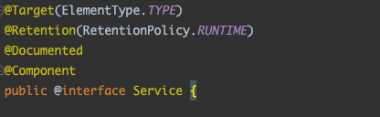
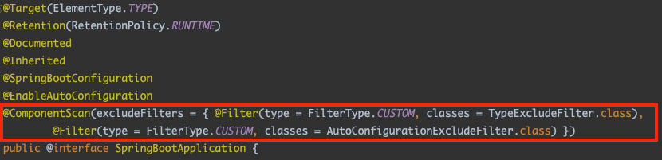
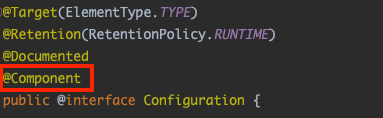

# 1. Spring Bean이란?

DI/IoC에 의해 우리는 스프링에게 객체의 생명주기를 스프링에게 맡기게 된다. 이로인해 스프링은 필요한 객체들을 **Spring Container**(IoC Container, Application Context)에 생성하고 생성한 객체들을 제공해주는데 이때 Spring Container가 관리하는 자바 객체(**POJO**(Plain Old Java Object))를 우리는 **Bean**이라고 한다.

Spring에서는 Bean들을 **싱글톤**으로 생성하여 관리를 한다.

## 1.1. Spring Bean 구성 요소

- **class**: Bean으로 등록 될 Java클래스
- **id**: Bean의 고유 식별자
- **scope**: Bean을 생성하기 위한 방법 (singleton, prototype 등)
- **constructor-arg**: Bean 생성 시 생성자에 전달할 파라미터
- **property**: Bean 생성 시 setter에 전달할 인수

# 2. Bean을 등록하는 방법

스프링이 빈을 등록하고 관리하는 방법은 xml, Annotation-based configuration, Java-based configuration 방법이 있다. 해당 게시글에서는 xml방법을 제외한 2가지 방법을 설명하겠다.

## 2.1. @Component, @ComponentScan

ComponentScan은 스프링이 직접 `@Component`어노테이션이 있는 클래스들을 찾아 자동으로 스프링 컨테이너에 Bean으로 등록해주는 기능이다. 스프링이 검색하여 빈으로 등록을 할 수 있게 하려면 빈으로 등록하려는 클래스에 `@Component` 어노테이션을 붙여줘야한다. 이때 빈의 이름은 기본적으로 클래스 이름의 첫 글자를 소문자로 바꾼 이름을 사용하며 다른 이름을 설정하고 싶을 경우 `@Component("newName"")`과 같이 value값을 설정해줘야 한다.

우리가 자주 사용하는 `@Controller`, `@Service`, `@Repository`, `@Configuration` 들이 빈으로 등록되었던 이유는 아래의 사진과 같이 기본적으로 `@Component` 어노테이션을 포함하고 있기 때문이다.



`@Component`가 붙은 클래스들을 빈으로 등록하려면 설정 클래스에서 `@ComponentScan`을 설정해줘야한다. `@ComponentScan`을 설정해주면 `basePackages`로 설정한 패키지의 하위 클래스 중 `@Component`가 붙은 클래스를 검색하고 생성하여 빈으로 등록해주게 된다.

```java
@Configuration
@ComponentScan(basePackages = {"packageName"})
public class AppCtx {
   ...
}
```

우리가 사용하는 SpringBoot 어플리케이션에는 위와 같이 설정 클래스를 생성하고 `@ComponentScan`을 붙이는 과정이 없어도 된다. 그 이유는 아래와 같이 `@SpringBootApplication`에 `@ComponentScan`이 붙어있기 때문이다.



📌  스프링은 기본적으로 컴포넌트 스캔을 이용해 빈을 등록하는 방법을 권장한다. 개발자의 입장에서도 해당 방법으로 빈으로 등록할 클래스에 `@Component`를 통해 빈을 등록하면 해당 클래스를 빈으로 등록되도록 잘 설정했는지 쉽게 파악할 수 있어서 좋기 때문이다.

## 2.2. @Configuration, @Bean

개발자가 직접 수동으로 스프링 컨테이너에 빈을 등록하기 위해서는 아래와 같이 `@Configuration`이 붙은 클래스 내에서 개발자가 직접 빈으로 등록하고 싶은 객체를 반환하는 메서드에 `@Bean`을 붙여줘야 한다.

```java
public class Greeter { }

@Configuration
public class AppContext {

    @Bean
    public Greeter greeter() {
        Greeter greeter = new Greeter();
        return greeter;
    }
}
```

이때 Bean의 이름은 메서드의 이름으로 결정되어 중복되지 않도록 주의해야 한다. @Bean을 빈으로 등록하는 과정은 다음과 같다. 먼저 스프링 컨테이너는 앞서 설명했듯이 `@Component` 어노테이션이 붙은 `@Configuration`이 붙은 클래스를 빈으로 등록하게 된다. 이후 해당 설정 클래스의 `@Bean`이 붙은 메서드를 찾아 빈들을 추가해준다.



📌  모두들 알고 있듯이 스프링은 빈들을 기본적으로 싱글턴으로 관리한다. 만약 중복된 여러 빈을 생성하고 싶다면 `@Configuration(proxyBeanMetods= false)`를 붙여주면 된다.

먼저 설명을 하였던 @Component 어노테이션을 사용하면 빈을 쉽게 등록할 수 있는데 @Configuration, @Bean을 사용해 빈을 등록은 어떤 상황에 할까? 수동으로 빈 등록은 보통 아래와 같은 상황에 한다.

- 개발자가 직접 제어가 불가능한 라이브러리를 사용할 때
  - Gson과 같이 외부에서 가져다쓰는 클래스인 경우 싱글톤으로 사용해야지 메모리상의 이점을 얻을 수 있다. 하지만 외부 클래스들은 우리가 직접 제어를 할 수 없기에 @Bean으로 수동 등록하여 사용해야 한다.
- 애플리케이션 전범위적으로 사용되는 클래스를 등록할 때
- 다형성을 활용하여 여러 구현체를 등록해줘야 할 때
  - `@Bean`을 통해 등록을 해주면 어떤 구현체들이 빈으로 등록되었는지를 `@Configuration`클래스만 보면 되어서 한 눈에 파악하기 쉽고 유지보수하기 좋다.

# 3. 빈의 라이프 사이클

스프링 컨테이너는 빈의 객체 생성, 의존 결정, 초기화, 소멸의 과정을 관리한다.

- **객체 생성**
- **의존 결정**: 의존 자동 주입을 통한 의존 설정과 설정 클래스에 있는 의존 주입들이 모두 수행된다.
- **초기화**: 의존 결정이 완료되면 스프링 빈은 빈 객체의 지정된 메서드를 호출하여 빈을 초기화해 준다.
- **소멸**: 스프링 컨테이너가 종료되면 스프링 컨테이너가 빈 객체를 소멸시킨다.

생성, 의존 결정 과정은 이전 게시글인 DI/IoC와 앞의 내용을 통해 이해할 수 있지만 그 뒤의 초기화, 소멸의 경우 생소한 내용이다. 초기화와 소멸 과정 필요한 예시로는 데이터베이스 커넥션 풀과 클라이언트 채팅 등이 존재한다. 커넥션 풀을 예시로 들면 빈을 사용하기 전에 일정 개수의 커넥션을 만들고 애플리케이션 종료 시점에 모든 커넥션을 닫아야 하는데 이러한 과정을 빈의 초기화, 소멸 과정에서 진행을 하게 된다. 채팅의 경우 채팅을 시작할 때 서버와의 연결을 생성하고 종료할 때 연결을 끊는데, 서버와의 연결을 생성하고 끊는 작업이 빈의 초기화, 소멸 과정에 진행되게 된다.

스프링은 이러한 초기화, 소멸 과정을 개발자가 정할 수 있게 `org.springframework.beans.factory.InitializingBean;` 인터페이스와 `org.springframework.beans.factory.DisposableBean;` 인터페이스를 제공하고 있다.

```java
public interface InitializingBean{
    void afterPropertiesSet() throws Exception;
}

public interface DisposableBean{
    void destroy() throws Exception;
}
```

초기화 및 소멸을 하는 과정에 특정 로직의 실행이 필요하다면 위의 인터페이스들을 상속받아 아래와 같이 `afterPropertiesSet()`, `destroy()`메서드를 재정의해주면 된다. 해당 인터페이스는 모두 상속해야하는 것이 아닌 상황에 따라 필요한 인터페이스만 상속받으면 된다.

```java
public class Client implements InitializingBean, DisposableBean {

    private String host;

    public void setHost(String host) {
        this.host = host;
    }

    @Override
    public void destroy() throws Exception {
        System.out.println("Client.destroy() 실행");
    }

    @Override
    public void afterPropertiesSet() throws Exception {
        System.out.println("Client.afterPropertiesSet() 실행");
    }
}
```

외부에서 제공받은 클래스와 같이 InitializingBean과 DisposableBean 인터페이스를 구현하기 어려운 경우 아래와 같이 `@Bean` 태그의 `initMethod`속성과 `destroyMethod`속성을 통해 초기화/소멸 메서드의 이름을 지정하면 된다.

```java
@Configuration
public class AppContext {
    @Bean(initMethod = "connect", destroyMethod = "close")
    public Client2 client2() {
        Client2 client2 = new Client2();
        client2.setHost("host");
        return client2;
    }
    // connect와 close는 Clients에 정의되어있는 메서드 이름
}
```

`initMethod`의 경우 빈을 초기화 과정에서 시행되는 것이어서 Bean 생성 메서드에서 직접 실행을 하여도 된다. 하지만 `InitializingBean`를 상속하여 `afterPropertiesSet()`를 재정의한 경우에는 빈의 초기화 과정에서 `afterPropertiesSet()`를 호출하기 때문에 중복된 호출이 발생하지 않도록 주의해야한다. 또한  `initMethod`, `destroyMethod`에서 호출되는 메서드는 파라미터가 없어야한다. 파라미터가 있을 경우 spring이 예외를 발생시킨다.

# 4. Bean Scope

## 4.1. Singleton Scope

Bean 객체의 범위로는 대표적으로 **싱글톤**과 **프로토타입**이 있다. 일반적으로 별다른 설정이 없다면 빈은 싱글톤 범위로 생성되어 사용된다.

```java
@Configuration
public class AppContext {
    @Bean
    public Client client() {
        Client client = new Client();
        return client;
    }
}
```

```java
Client client1 = ctx.getBean("client", Client.class);
Client client2 = ctx.getBean("client", Client.class);
// client1 == client2 -> true
```

싱글톤으로 생성되기에 `getBean()`을 통해 가져온 객체들은 모두 같은 객체가 된다.

## 4.2. Prototype Scope

`getBean()`을 할 때마다 새로운 객체를 생성하도록 하려면 빈의 범위(Scope)을 프로토타입으로 설정해주면 된다.

```java
@Configuration
public class AppContext {
    @Bean
    @Scope("prototype")
    public Client client() {
        Client client = new Client();
        return client;
    }
}
```

```java
Client client1 = ctx.getBean("client", Client.class);
Client client2 = ctx.getBean("client", Client.class);
// client1 == client2 -> false
```

프로토타입 빈으로 생성을 하게되면 `getBean()`을 할 때마다 매번 새로운 객체를 생성하여 반환하게 된다.

📌  프로토타입 빈을 사용하면 빈은 객체 생성, 프로퍼티 설정 및 초기화 작업까지는 수행하지만, 컨테이너를 종료한다고 해서 생성한 빈의 프로토타입 빈의 소멸 메서드를 실행하지는 않는다. 즉, 소멸 과정이 실행되지 않아 프로토타입 범위의 빈을 사용할 때는 빈 객체의 소멸 처리를 코드에서 직접 해줘야 한다.

# Reference

- [초보 웹 개발자를 위한 스프링5 프로그래밍 입문 - 챕터 2, 3, 5, 6](https://book.naver.com/bookdb/book_detail.nhn?bid=13786861)
- [[Spring] 빈 등록을 위한 어노테이션 @Bean, @Configuration, @Component 차이 및 비교 - (1/2) MangKyu's Diary](https://mangkyu.tistory.com/75)
- [[Spring] @Configuration 안에 @Bean을 사용해야 하는 이유, proxyBeanMethods - (2/2) MangKyu's Diary:티스토리](https://mangkyu.tistory.com/234)
- [스프링 빈(Spring Bean)이란? 개념 정리](https://melonicedlatte.com/2021/07/11/232800.html)
