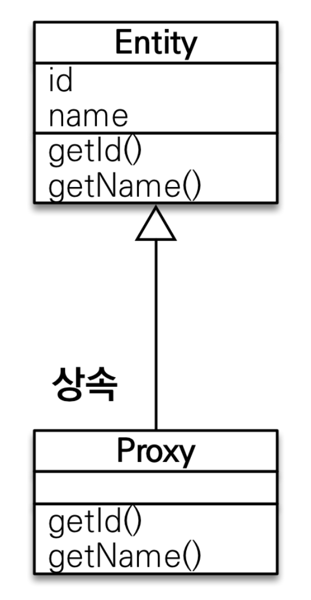
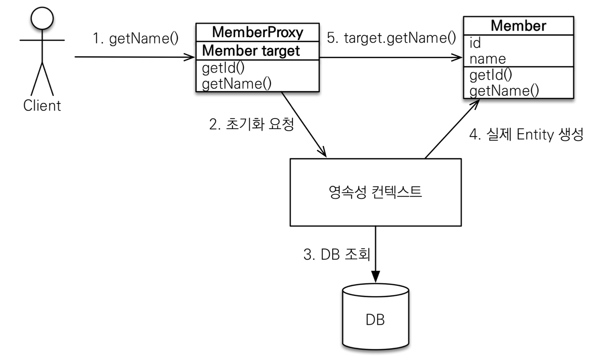
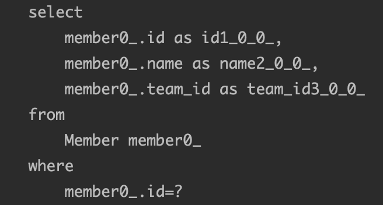
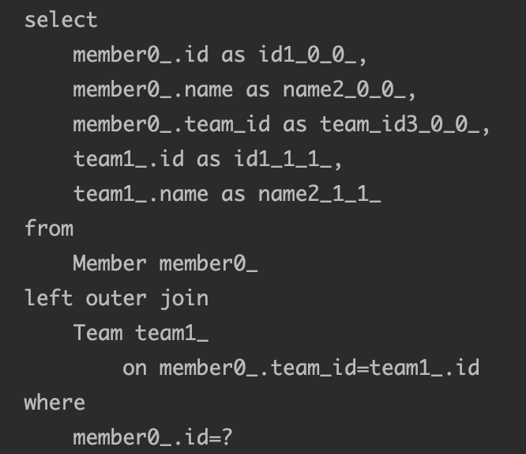

> 해당 포스트는 인프런 김영한님의 [자바 ORM 표준 JPA 프로그래밍 - 기본편](https://www.inflearn.com/course/ORM-JPA-Basic/dashboard) 강의를 기반으로 작성하였습니다.


# 1. JPA의 Proxy

JPA의 Fetch 전략에 대한 자세한 이해를 위해서는 프록시의 개념을 먼저 알아야 한다. 사실 프록시의 개념은 Spring AOP를 학습해본 사람이라면 알고 있을법한 개념이다. 프록시를 간단하게 설명하자면 실제 클래스를 상속받아서 만들어진 가짜 객체라고 이해하면 된다. JPA는 이러한 프록시의 개념을 사용하여 지연로딩을 지원하고 있다.

## 1.1. EntityManager의 getReference()

JPA의 entityManager는  엔티티를 조회하는 메서드로 `find()` 메서드 이외에 `getReference()`메서드도 지원하고 있다.

```java
package javax.persistence;

public interface EntityManager {
    public <T> T find(Class<T> entityClass, Object primaryKey);
    
    public <T> T getReference(Class<T> entityClass,
                              Object primaryKey);
}
```

`find()` 와 `getReference()` 메서드 모두 엔티티를 조회하는 메서드이긴 하지만 둘은 반환하는 값이 다르다. `find()` 메서드는 DB로부터 실제 엔티티 객체를 조회 후 반환을 한다. 하지만 `getReference()` 메서드는 실행될 때 하이버네이트가 만든 가짜 엔티티 객체(Proxy)를 조회하고 실제 DB로부터 조회는 해당 가짜 객체로부터 값을 뽑아서 사용하려고 할 때 조회된다. 즉, DB에 접근을 하지 않고 가짜 객체인 프록시를 조회하는 것이다!!!

실제로 아래의 코드를 테스트해보면 출력값으로 Member의 프록시 객체인 `hellojpa.Member$HibernateProxy$Df3uLdc3` 라는 값이 반환된다.

```java
...
Member member = new Member();
member.setName("Rex");
em.persist(member);

em.flush();
em.clear();

Member memberReference = em.getReference(Member.class, member.getId());
System.out.println(memberReference.getClass().getName());
...
```

프록시가 getReference()를 하였을 때, 반환값을 Member객체에 매핑할 수 있는 이유는 앞서 말했듯이 프록시가 실제 클래스를 상속받아서 만들어졌기 때문이다.



그래서 프록시는 실제 클래스와는 겉 모양이 같으며 실제로 사용하는 개발자 입장에서는 프록시가 진짜 객체인지 가짜 객체인지 구분하지 않고서도 개발을 할 수 있는 것이다.

## 1.2. 프록시 객체의 조회 플로우

가짜 객체인 프록시가 실제 객체를 상속하여 만든다는거까지는 알게 되었다. 그러면 내부 값이 비어있고 껍데기만 같은 프록시 객체를 통해 데이터를 조회할때 JPA는 어떻게 실제 값을 반환하게 될까?? 프록시 객체는 실제 객체의 참조값을 보관하고 있다가 프록시 객체 통해 값을 찾게 된다면 참조값을 통해 실제 객체의 메서드를 호출하는 방식으로 진행된다. 프록시 객체에서 실제 객체의 값을 조회하는 플로우는 아래의 이미지와 같다.



> 프록시 객체의 경우 첫 메서드를 호출하기 전에는 target이 비어있는 상태로 존재하게 된다.
>
1. getName()메서드를 통해 Member의 이름을 조회하게 된다면 target을 확인한다.
    1. 연결된 객체가 있다면 해당 target 객체의 getName()메서드를 호출하여 결과를 반환한다.
2. 1번 단계에서 연결된 객체가 없다면 영속성 컨텍스트에 target 객체의 초기화를 요청한다.
3. 영속성 컨텍스트는 DB에서 target 객체를 찾아 저장한다.
4. 찾은 target 객체를 이용해 실제 Entity를 생성하고 Proxy객체의 target에 연결한다.
5. 연결된 target객체의 getName()메서드를 호출하여 결과를 반환한다.

## 1.3. 프록시의 특징

여기서 알아야 할 점과 주의해야할 점들이 존재한다.

- 프록시 객체의 Target은 **처음 한번 사용할 때만 초기화**한다. 초기화 할 때는 위의 플로우로 진행이 되며 프록시 객체를 초기화 한다고 프록시 객체가 실제 엔티티로 바뀌는 것은 아니다. 단순히 **실제 엔티티 객체와 프록시의 target 필드를 연결하는 것이 초기화이다.**
- 프록시 객체는 앞서 반복해서 말했듯이 실제 클래스를 상속하여 만든 객체이다. 실제 객체와 프록시 객체의 클래스 타입은 엄연히 다른 것인만큼 타입 비교를 한다면 `==` 비교대신 `instance of`를 사용해야 한다.
- JPA의 특징 중 하나로는 하나의 영속성 컨텍스트 안에서 하나의 PK값을 가진 객체들은 `==`을 하였을때 true를 리턴하는 특징이 있다. 이러한 이유때문에 하나의 데이터에 대해서 `find()`를 먼저 한 후 이후 `getReference()`를 하게되면 프록시가 아닌 영속성 컨텍스트에 저장된 entity객체가 반환되게 된다. 반대로 `getReference()`가 실행되고 이후에 `find()`가 실행될 경우 `find()`의 결과로 entity객체가 아닌 프록시객체가 반환되게 된다.
- 프록시 객체는 트랜잭션 종료와 같이 영속성 컨텍스트의 도움을 받을 수 없는 준영속 상태가 될 경우, 해당 프록시를 초기화(값을 연결)시켜 주려고 하면 `org.hibernate.LazyInitializationException: could not initialize proxy ~~ - no Session`과 같은 exception이 발생한다.

## 1.4. 프록시 객체 확인 관련 메서드

- 프록시 인스턴스의 초기화 여부 확인

  `(EntityManagerFactory) emf.getPersistenceUtilUtil().isLoaded(proxy객체);`

- 프록시 클래스 확인

  `proxy객체.getClass()`

- 프록시 강제 초기화

  `Hibernate.initialize(proxy객체);`


# 2. 지연로딩과 즉시 로딩

즉시로딩과 지연로딩은 이전 포스트에서 살펴봤던 연관관계 매핑의 fetch 전략들이다.

## 2.1. 지연로딩 (FetchType.LAZY)

지연로딩은 앞서 살펴봤던 프록시를 통해 구현된다.

```java
@Entity
public class Member {
    ...
    @ManyToOne(fetch = FetchType.LAZY)
    @JoinColumn(name = "team_id")
    private Team team;
}

@Entity
public class Team {
    ...
}
```

위와 같이 Member에서 Team에대한 fetch전략을 Lazy로 하게 된다면 Member객체를 조회하였을 때, Team 객체가 조회되지 않고 Team필드에는 프록시 객체가 들어가게 된다. 실행된 쿼리문을 살펴봐도 Team에 관련된 조회는 없고 Member에 대한 조회만 발생하게 된다.



그러면 Team은 언제 조회가 될까?? 앞서 Proxy의 개념을 살펴보며 학습하였듯이 해당 프록시 객체는 실제로 Team을 사용하는 시점에 DB에 select 쿼리를 날리며 초기화를 하게 된다.

> 지연로딩은 `@~ToMany` 연관관계 매핑 어노테이션들에서 기본 전략으로 사용되고 있다.
>

## 2.2. 즉시로딩 (FetchType.EAGER)

```java
@Entity
public class Member {
    ...
    @ManyToOne(fetch = FetchType.EAGER)
    @JoinColumn(name = "team_id")
    private Team team;
}

@Entity
public class Team {
    ...
}
```

즉시 로딩은 앞서 살펴본 지연로딩과 다르게 Member객체를 조회할 경우 연관된 Team객체에 대한 정보들도 Join문을 통해 모두 가져오게 된다. Member를 조회하는 명령을 하였을 때 실행되는 쿼리를 살펴보면 아래와 같이 Join문을 사용하여 한번에 데이터를 가져오는 것을 확인할 수 있다.



> 지연로딩은 `@~ToOne` 연관관계 매핑 어노테이션들에서 기본 전략으로 사용되고 있다.
>

### 2.2.1. 즉시로딩.. 주의할 점

즉시로딩은 몇가지 주의할 점이 있다.

- **즉시로딩은 개발자가 예상하지 못한 SQL문이 발생할 수 있다.** 위의 예시의 경우 Member와 Team 객체만의 연관관계를 이용해 테스트를 하여 2개의 테이블 사이에 Join이 발생하였다. 하지만 여러개의 테이블이 있을 경우를 상상해보면 10개의 테이블이 Join이 되는 예상치 못한 어마어마하게 긴 SQL이 발생할 수 있다.

- **즉시로딩은 JPQL에서 N+1문제를 일으킬 수 있다.** `em.find()`와 같이 영속성 컨텍스트를 통해 조회하는 경우는 PK이용해 조회하는 것이라 JPA가 내부적으로 join을 통해 연결할 수 있다. 하지만 JPQL의 경우는 String이 그대로 SQL로 변경되는 것이라 처음에 특정 테이블을 읽어오고 EAGER로 연결된 다른 테이블이 존재한다면 다시 해당 테이블을 읽어오는 SQL문을 실행하고~실행하고~계속 타고 들어가게 되어 N+1개의 쿼리문이 수행되게 되는 문제가 발생할 수 있다.

## 2.3. 실무 Tip 📌

1. 모든 연관관계에서 지연로딩(LAZY)를 사용해라.
2. 실무에서 즉시로딩을 사용하지 마라.
3. JPQL fetch 조인이나 Entity grapgh 기능을 사용해라
4. 즉시 로딩은 상상하지 못한 쿼리가 날아간다는 점을 기억해라.
5. @OneToOne, @ManyToOne은 조심하자. 기본이 즉시로딩이므로 LAZY로 꼭 설정하고, @OneToMany나 @ManyToMany는 기본이 지연로딩이니까 그냥 두자

# 📚 Reference
- [자바 ORM 표준 JPA 프로그래밍 - 기본편 - 인프런 | 강의](https://www.inflearn.com/course/ORM-JPA-Basic/dashboard)
- [JPA 5 : 프록시(Proxy)란? 지연로딩(LAZY), 즉시로딩(EAGER), N+1문제](https://eocoding.tistory.com/31)
- [JPA Proxy](https://velog.io/@sa1341/JPA-Proxy)
