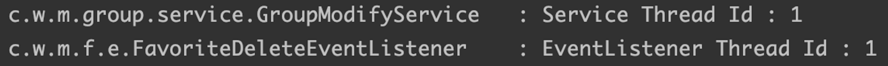
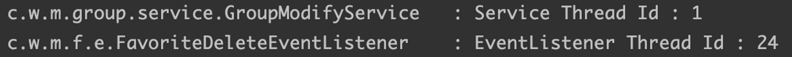
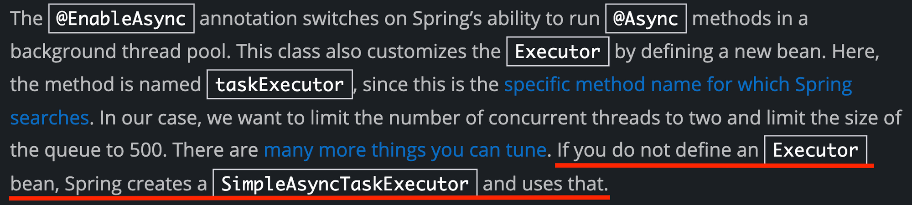
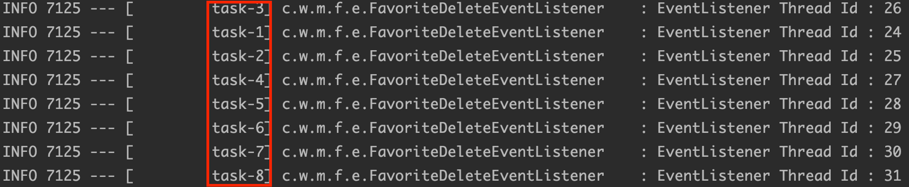
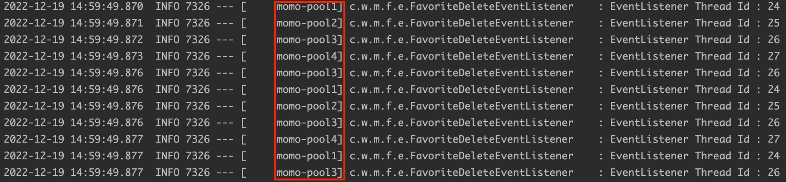

# 기존의 동기 처리 이벤트

기존 모모팀의 불필요한 찜하기 데이터의 삭제 로직은 모임이 삭제되었을 때, 또는 회원이 탈퇴하였을 때 연관된 찜하기 데이터가 삭제되도록 이벤트 기반으로 구현되어있었다. 바로 코드를 살펴보겠다. 기존 코드는 일반적인 `@EventListener`와 함께 비동기 처리를 하지 않아 동기로 작동하고 있었다. 그리하여 Participant와 Group이 트랜잭션을 서로 공유하고 있었다.

```java
@RequiredArgsConstructor
@Slf4j
@Component
public class FavoriteDeleteEventListener {

    private final FavoriteRepository favoriteRepository;

    @EventListener
    public void deleteGroup(GroupDeleteEvent event) {
        favoriteRepository.deleteAllByGroupId(event.getId());
        log.info("EventListener Thread Id : {}", Thread.currentThread().getId());
    }

    ...
}
```

테스트를 해보면 서비스 로직과 이벤트 리스너의 실행 쓰레드 ID가 같은 것을 확인할 수 있다.



두 로직이 트랜잭션을 공유한다는 것은 찜하기 데이터의 삭제 쿼리를 실행하는 과정에서 문제가 발생하여도 모임 삭제 쿼리까지 롤백된다는 것을 의미한다. 사용자는 모임을 삭제하라고 요청을 보냈을 때, 사용자가 원하는 모임 외에 부가적으로 연관된 데이터의 삭제가 실패했다는 이유로 모임 삭제가 실패하게 된다.

앞서 모모팀은 찜하기 기능을 부가기능으로 판단하고 모임 로직과의 의존성을 분리하기 위해 Event방식을 사용하였다. 하지만 이벤트를 하나의 트랜잭션으로 묶어 동기 처리로 동작하는 처리방식은 부가기능의 장애가 모임 로직에 영향을 주는 코드가 되어 장애 측면에서 **모임이 부가기능에 의존**하는 코드를 만들게 된다.

이러한 부가기능의 장애가 메인 기능으로 전파되는 문제를 해결하고자 Event 처리의 동작 방식을 비동기로 변경하는 작업을 진행해보려 한다.

# Event를 비동기로 처리

이벤트를 비동기로 처리하기 위해서는 먼저 `@EnableAsync`를 스프링부트 애플리케이션을 실행시키는 메인 클래스 또는 설정 클래스에 붙여 비동기를 활성화시켜줘야 한다.

```java
@Configuration
@EnableAsync
public class AsyncConfiguration {
}
```

그 후에는 비동기 처리를 할 이벤트 처리를 할 `@EventListener`이 붙은 메서드에 `@Async`를 붙여주면 해당 로직은 비동기처리가 된다. 그리고 이전에는 동기로 처리하며 트랜잭션을 공유하기에 메서드에 `@Transactional`을 붙여주지 않아도 되었다. 하지만 비동기로 처리하게 되며 트랜잭션이 분리되어 둘의 찜하기 데이터를 삭제하는 로직은 트랜잭션이 없게 되어 메서드 또는 클래스에 `@Transactional`어노테이션을 통해 트랜잭션을 부여해주어야 한다.

```java
@RequiredArgsConstructor
@Slf4j
@Transactional
@Component
public class FavoriteDeleteEventListener {

    private final FavoriteRepository favoriteRepository;

    @EventListener
    @Async
    public void deleteGroup(GroupDeleteEvent event) {
        favoriteRepository.deleteAllByGroupId(event.getId());
        log.info("EventListener Thread Id : {}", Thread.currentThread().getId());
    }

    ...
}
```

테스트를 통해 확인해보겠다. 앞서 동일한 트랜잭션 내에서 실행되었던 로직들이 비동기로 처리되며 서로 다른 트랜잭션에서 실행되는 것을 확인할 수 있다.



# 비동기 Thread pool 지정



스프링 가이드를 살펴보면 아래와 같이 `Executor` 빈을 정의하지 않으면 `@EnableAsync`와 `@Async`를 통해 비동기 처리만 하게 된다면 비동기 작업을 `SimpleAsyncTaskExecutor`를 매번 만들어 처리한다는 것을 알 수 있다.

실제로 그런지 임시로 비동기로 처리하는 이벤트를 발생시키는 메서드를 만들고 100번 루프를 돌리며 테스트를 해보겠다.

```java
@Service
public class GroupModifyService {
	...
	public void publishEvent(Long id) {
        applicationEventPublisher.publishEvent(new GroupDeleteEvent(id));
    }
}
```

```java
@SpringBootTest
class FavoriteDeleteEventListenerTest {		
	...
	@DisplayName("비동기 처리를 하는 쓰레드를 테스트한다.")
    @Test
    void asyncThreadExecutorTest() {
        for (int i = 0; i < 100; i++) {
            groupModifyService.publishEvent(1L);
        }
    }
	...
}
```



테스트 결과는 `Task-N` 이라는 이름의 스레드가 생성되어 비동기 작업이 실행되는 것을 확인할 수 있다. 매번 작업을 실행할 때마다 스레드를 만들고 제거하는 것은 성능 측면에서 저하를 불러일으킨다. 이를 해결하는 대표적인 방법은 Thread Pool을 만들어 필요한 스레드를 먼저 만들고 스레드를 재사용하는 방법이 있다.

스레드 풀을 만들기 위해 기존 `@EnableAsync`를 처리하기 위해 생성한 설정 클래스에 `ThreadPoolTaskExecutor`를 반환하는 `Executor` 빈을 재정의하고 다시 테스트를 진행해보았다.

```java
@Configuration
@EnableAsync
public class AsyncConfiguration {

    @Bean
    public Executor asyncThreadTaskExecutor() {
        ThreadPoolTaskExecutor threadPoolTaskExecutor = new ThreadPoolTaskExecutor();
        threadPoolTaskExecutor.setCorePoolSize(4);
        threadPoolTaskExecutor.setMaxPoolSize(4);
        threadPoolTaskExecutor.setThreadNamePrefix("momo-pool");
        return threadPoolTaskExecutor;
    }
}
```

결과는 아래와 같이 미리 만들어둔 스레드 풀에서 요청을 처리하기 위해 스레드를 생성하여 재사용하는 것을 확인할 수 있다.



# 이벤트 바인딩 시점 지정

Spring 4.2부터는 트랜잭션의 동작 단계별로 이벤트 리스너를 바인딩하는 `@TransactionalEventListener` 을 제공하고 있다. 기존의 `@EventListener`대신 `@TransactionalEventListener` 를 사용하며 아래의 옵션을 지정하면 이벤트를 publish하는 트랜잭션의 동작을 기준으로 바인딩 시점을 지정할 수 있다.

- `AFTER_COMMIT` (기본값) - 트랜잭션이 성공적으로 마무리(commit)됬을 때 이벤트 실행
- `AFTER_ROLLBACK` – 트랜잭션이 rollback 되었을 때 이벤트 실행
- `AFTER_COMPLETION` – 트랜잭션이 마무리 되었을 때(commit or rollback) 이벤트 실행
- `BEFORE_COMMIT` - 트랜잭션의 커밋 전에 이벤트 실행

프로젝트의 코드에서는 모임 또는 회원이 성공적으로 삭제되었을 때, 연관된 찜하기 데이터가 삭제되어야함으로 옵션의 기본값인 `AFTER_COMMIT`를 사용하였다.

```java
@RequiredArgsConstructor
@Slf4j
@Transactional
@Component
public class FavoriteDeleteEventListener {

    private final FavoriteRepository favoriteRepository;

    @TransactionalEventListener
    @Async
    public void deleteGroup(GroupDeleteEvent event) {
        favoriteRepository.deleteAllByGroupId(event.getId());
        log.info("EventListener Thread Id : {}", Thread.currentThread().getId());
    }

    ...
}
```

# 📚Reference

- [Core Technologies](https://docs.spring.io/spring-framework/docs/current/reference/html/core.html#context-functionality-events-async)
- [Data Access](https://docs.spring.io/spring-framework/docs/current/reference/html/data-access.html#transaction-event)
- [Creating Asynchronous Methods](https://spring.io/guides/gs/async-method/)
- [Baeldung- Spring Events](https://www.baeldung.com/spring-events#transaction-bound-events)
- [Spring ApplicationEvent 비동기로 처리될 것만 같지?](https://jeong-pro.tistory.com/238)
