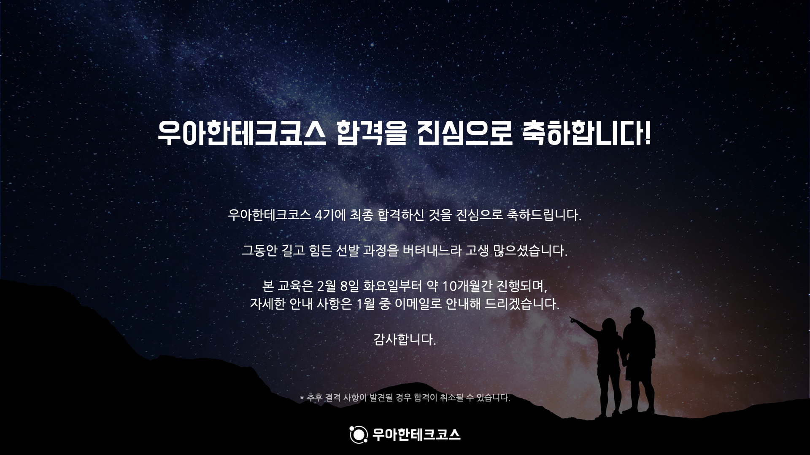

12월 30일인 어제 우테코의 최종 결과가 나왔습니다.
최종 코딩테스트에서 모든 기능을 완벽하게 구현하지 못하고 구현하지 못한 부분도 있어서 떨어지면 어떡하지?하는 불안감이 있었으나 **합격**이라는 결과를 받았습니다.😁😁

이로써 22년 2월부터 우테코 백엔드 4기 교육생으로 10개월이라는 기간동안 교육을 받으며 성장할 수 있게 되었습니다.

우테코가 시작하기까지 한달이라는 시간이 남았습니다.
저는 이 한달은 비교적 편한 마음으로 이전에 공부하던 스프링 프레임워크의 학습과 개인 프로젝트를 진행하며 보내볼까 합니다. (때마침 인프런에서도 6주년 이벤트로 30프로 할인 행사가 진행하여 우아한 형제들 개발팀장인 영한님의 jpa강의도 몇개 구매를 하여 해당 내용을 다시 학습해보려고 합니다.🤗)

우아한형제들의 정직원이 되겠다는 마음가짐으로 내년 1년동안 우테코에 열심히 임하며 성장하는 개발자가 되겠습니다🔥🔥🔥
