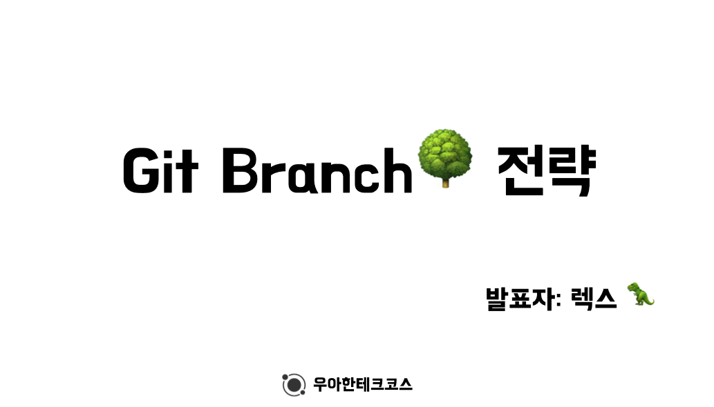
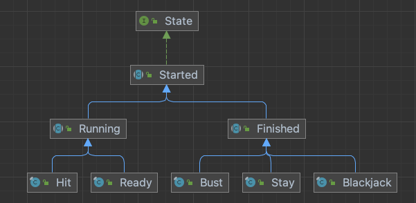

# 테코톡 발표 (3월 10일)

과거 유튜브를 통해서만 접하였던 테코톡을..드디어 찍었습니다.

제가 발표한 주제는 `bit branch 전략`이었습니다. 우테코에 들어와 이전까지 몰랐던 git에 대해 배우다보니
혼자 추가적으로 공부하며 git branch전략까지 배우게 되었고, 해당 내용이 매우 흥미롭게 느껴져서 발표까지 하게 되었습니다. 각자의

발표는 준비 기간이 짧고 페어 프로그래밍 주와 겹쳐서 많이 힘들었으나 잠을 줄여..무사히 마칠 수 있었습니다.

발표 내용은 다음과 같이 branch전략의 소개로부터 github flow, git flow에 대한 자세한 설명들을 하였습니다.

우테코 근로 장학생들이 뽑히게 된다면 테코톡 영상들도 곧 올라갈테니 많이들 시청 부탁드립니다.😁

# 블랙잭 미션

블랙잭 미션은 다음과 같은 요구사항이 추가되었습니다.

- 모든 엔티티를 작게 유지한다.
- 3개 이상의 인스턴스 변수를 가진 클래스를 쓰지 않는다.
- 딜러와 플레이어에서 발생하는 중복 코드를 제거해야 한다.

다음 구조가 추가되었어도 페어인 `라쿤`과 만나서 하루만에 구현을 완료하여 이전 미션들과 비슷한
난의도라 생각했습니다..하지만 구현을 완료 후 다른 사람들의 코드를 보고, 네오의 블랙잭 피드백 강의를 듣고 많은 충격을 받았습니다.

먼저 제가 구현한 블랙잭은 기능들이 많이 빠진 이빨 빠진 블랙잭이었습니다.
그리고 이번 미션의 목표가 상속과 인터페이스를 학습하는 것이었는데 저의 코드는 상속과 인터페이스를 활용하긴 했지만 활용도가 매우 적었습니다.
네오의 강의에서 네오는 상속과 인터페이스를 활용한 `상태패턴`을 사용한 강의를 하였습니다.

강의를 처음 들을 때는 기존에 내가 작성하였던 코드와 접근법 자체가 완전히 달라서 코드 자체를 이해하지 못하였으나 그날 밤에
올라온 다시보기 영상으로 다시 보니 코드를 이해할 수 있었습니다.

> 상태 패턴(state-pattern)은 스테이트 패턴은 객체가 특정 상태에 따라 행위를 달리하는 상황에서, 자신이 직접 상태를 체크하여 상태에 따라 행위를 호출하지 않고, 상태를 객체화 하여 상태가 행동을 할 수 있도록 위임하는 패턴을 말합니다.

네오의 상태패턴을 적용한 결과 상태들의 상속관계는 다음과 같았습니다.

상태패턴을 적용함으로써 blackjack, hit, stand, ready 등의 유저 별 상태를 확실히 표현할 수 있었고,
그 상태에 맞는 메서드 반환 값을 반환하기 편하다는 장점이 있었습니다.

이번 미션에서는 네오의 강의 이외로도 `이프`, `마루`와 함께 코드 리뷰를 하는 시간을 갖으며 많은 도움이 되었습니다.
두 분이 제 코드를 하나씩 상세하게 봐주며 저의 코드의 문제점들, 개선하면 좋겠는 점들을 지적해주며
저의 코드의 문제점들을 알 수 있었고 앞으로는 다른 방법으로 프로그래밍을 해야겠다~는 다짐을 하게 되었습니다.
코로나 이슈로 인해 몸 상태가 좋지 않은 관계로 모든 피드백을 다 고치진 못하였지만..확실히 많은 도움이 되었습니다

자세한 코드와 리뷰들은 아래의 링크를 통해 확인할 수 있습니다.

> ## 피드백을 주고받은 PR & 작성 코드
>
> - [[1단계 - 블랙잭] 렉스(오성원) 미션 제출합니다. #257](https://github.com/woowacourse/java-blackjack/pull/257)
> - [작성한 1단계 미션 코드](https://github.com/Seongwon97/java-blackjack/tree/step1)
> - [[2단계 - 블랙잭(베팅)] 렉스(오성원) 미션 제출합니다. #311](https://github.com/woowacourse/java-blackjack/pull/311)
> - [작성한 2단계 미션 코드](https://github.com/Seongwon97/java-blackjack/tree/step2)
> - [블랙잭 미션 피드백 정리](http://localhost:4000/posts/%EC%9A%B0%ED%85%8C%EC%BD%94-%EB%A0%88%EB%B2%A81-%EB%B8%94%EB%9E%99%EC%9E%AD-%ED%94%BC%EB%93%9C%EB%B0%B1%EC%A0%95%EB%A6%AC/)\_
