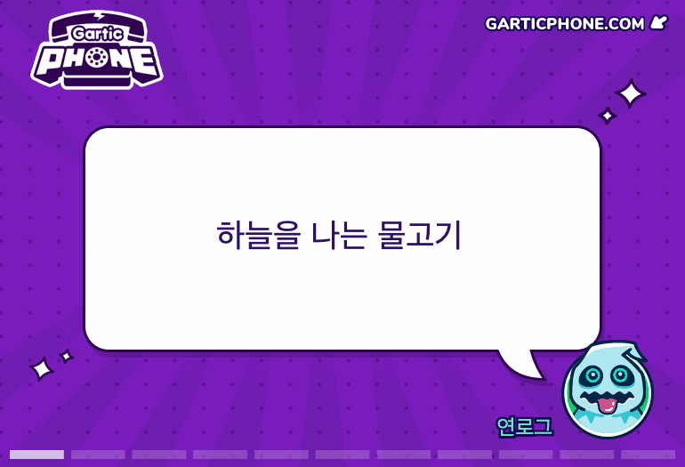
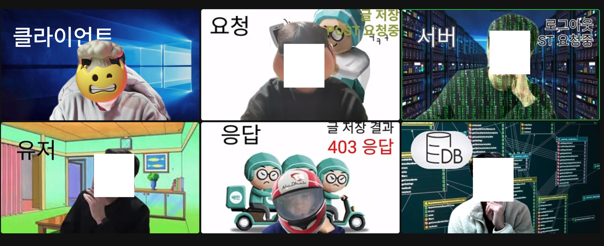

2월 8일 우테코 정식 기간이 시작되고 벌써 2주라는 시간이 흘렀네요.

크루들의 블로그를 보면 일주일 단위로 회고록을 올리는 크루들이 많았지만, 저는 우아한테크코스 기간이 10개월이라는 매우 긴 기간임을 감안하여
미션당 한번의 회고를 작성해볼까합니다.

오늘 작성하는 회고록은 2주라는 시간동안 저는 어떤 활동을 했는지, 어떤 것을 배우고 공부하였는지, 여러 활동을 통해 어떤 것을 느꼈는지 회고를 해보려합니다.

# 데일리 미팅

우테코는 하루 일과를 시작하기 앞서 하루에 30분씩 팀원들과 데일리 미팅이라는 것을 합니다.
데일리 미팅은 레벨별로 코치 한분과 랜덤하게 짜여진 크루들이 한 팀이 되어 운영됩니다.

데일리 미팅 시간에는 새로운 공지사항 안내 및 대화를 통한 친목 다지기 활동을 합니다.
코로나 시국이라 아직 교육장에 가보지 못해 여러 크루들을 직접 만나지 못해 아쉽지만
데일리 미팅을 통해 여러 크루들이랑 코치들과 매일 30분씩 사적인 이야기를 포함한 여러 이야기를 나누어 매우 좋았던 것 같습니다.

데일리 미팅때 어떤 대화를 나누나?에 대해 궁금하실 수 있습니다.
제가 속한 `구구`조의 활동을 이야기하자면 처음에는 코치 주도하에 모두 모르는 만큼 크루들의 자기소개 및 질의응답 시간을 가졌던 것 같습니다.
모두의 자기소개가 끝난 뒤인 현재는 크루들이 돌아가며 미팅의 사회자?가 되어 사회자가 준비한 활동을 하며 친목을 다지고 있습니다.

사회자가 준비한 활동 중 가장 기억에 남는 활동이 있다면 `레오`가 준비한 `Gartic phone`게임이었던 것 같습니다.
아래의 이미지는 마지막 한 문제를 끝까지 맞춘 기념으로 저장한 이미지입니다😁

`포비`가 첫번째 데일리 조가 가장 오래간다고 하였는데 빨리 코로나 확진자 수가 줄어 데일리 팀들을 직접 만나 이야기하고..일과가 끝나고 가끔씩 술도 한잔씩 마실 수 있는 기회가 오면 좋겠습니다🥲

# 페어 프로그래밍

페어 프로그래밍은 우테코의 핵심? 활동이라고 할 수 있는 활동입니다.
페어 프로그래밍은 우테코를 지원한 사람이라면 대부분의 사람이 알고 있을 활동일겁니다. 미션별로 랜덤하게 짝이 정해지면 그 짝과 함께 미션의 1단계 부분을 같이 프로그래밍하게 됩니다.

둘이 같이 프로그래밍한다?? 그럼 둘이 팀이되어 분업을 하는건가??라고 생각을 하실 수 있습니다.
하지만 **페어 프로그래밍은 분업이 아닌 협업**인 점을 기억해주셔야합니다.

일반적으로 여러명에서 하나의 프로그래밍을 한다면 각각 파트를 나누고 따로 프로그래밍을 하고
나중에 합치는 것을 생각하실 겁니다. 하지만 페어 프로그래밍은 두명의 크루가 하나의 노트북으로 시간을 정하여 한명은 `네비게이터`, 한명은 `드라이버`가 되어 프로그래밍을 하게 됩니다.

> - `드라이버`는 노트북을 잡고 직접 프로그래밍을 하는 역할을 뜻합니다.
> - `네비게이터`는 드라이버의 옆에서 코드를 작성할 방향과 여러 아이디어를 제공하는 역할을 뜻합니다.

이렇게 두 역할을 서로 번갈아가며 진행을 하며 코드를 작성하며 각자의 아이디어 차이, 코딩 스타일에 따른 토론을 중간중간 진행해 더 좋은 코드, 가독성 좋은 코드를 만들게 됩니다.
또한 서로의 부족함을 토론을 통해 채워가는 장점 또한 느낄 수 있습니다.

저의 첫 페어 프로그래밍의 페어는 바로 [스컬](https://github.com/skullkim) 이었습니다. 스컬과 함께 페어 프로그래밍을 진행하며 1단계 미션을 진행하며 TDD개발론을 학습할 수 있었으며
스컬에게 그동안 잘 몰랐던 stream, Git 명령어 등의 여러 내용을 배울 수 있던 좋은 기회를 가졌던 것 같습니다. 👍🏻

# 보이는 라디오

크루들끼리의 아이스브레이킹을 위해 우테코에서는 보이는 라디오라는 프로그램을 진행하였습니다.
처음에 보이는 라디오를 한다고 하였을 때는 코치들의 강의인가?라는 생각을 하였으나 설명을 듣고 많은 충격을 받았습니다..

보이는 라디오는 강의가 아닌 크루들의 친목을 위해 팀별로 5분간의 연극을 하는 프로그램이었던 것입니다🤯
저는 레크레이션, 연극, 춤 등의 활동을 진행하는 것을 별로 좋아하지 않았기에..난 개발을 배우려 왔는데 이러한 활동을 왜 하는거지..?와 같은 의문과 함께
하기 싫다..라는 생각만 계속 하얐던 것 같습니다.

하지만 보이는 라디오가 끝난 뒤에는 이러한 생각이 조금은 바뀌었습니다. 비록 크루들끼리 아직까지 직접 만나서 대화를 하지는 못하였으나
줌을 통해서라도 여러 크루들을 만나보고 서로의 연기를 보며 웃고 정말 재밋던 것 같습니다😁
특히 같은 팀원들과 연극 주제선정, 대본작성, 연극 연습 등의 여러 활동을 위해 수많은 시간 동안 대화를 나누다보니 서로 친해지게 된 것 같습니다.

학교에서 처음 사귄 친구가 평생 친구가 되듯이 이번에 같이 연극을 한 `마르코`, `동키콩`, `스컬`, `이프`, `슬로`와는
교육장으로 가서 교육을 받게 된다면 같이 밥이라도 먹으며 여러 대화를 나누고 더욱 친해게 지내고 싶습니다😎

# 미션 회고

## 미션 내용 정리

이번 미션은 프리코스 2주차 미션으로 하였던 자동차 미션과 동일한 미션이었습니다.
하지만 프리코스 때와 다른 점이 있다면 이번 미션은 **TDD 학습**을 진행하기 위해 TDD로 개발을 진행하여야 했다는 점이 있었습니다.
또한 프리코스에서 허용되는 들여쓰기가 2였으면 이번 미션에서는 한 메서드에 들여쓰기 1개만 허용한다는 점이 바뀌었습니다.

## 미션 진행 방식

미션은 앞서 소개하였던 페어 프로그래밍으로 시작을 했습니다. 미션을 시작하고 3일간 페어인 `스컬`과 함께 페어 프로그래밍으로 진행을 하였으며 1단계 미션이 끝나면
페어와 헤어지고 그 이후에는 각자 2번째 미션을 진행하는 방식으로 진행되었습니다.

미션이 끝나 페어와 헤어진 이후에는 각자 리뷰어에게 PR을 보내고 받은 피드백을 반영하고 각자의 스타일, 추가적으로 학습한 내용에 따라 리펙터링을 진행하며
최종 코드를 제출을 하는 방법으로 진행이 되었습니다.

## 리뷰어의 피드백

2주간 우테코를 진행하며 저는 리뷰어의 피드백이 우테코의 가장 큰 장점이라고 생각됐습니다.
미션의 각 단계가 끝날 떄마다 현장에서 실무를 뛰고 있는 리뷰어들은 크루들의 코드를 하나씩 보며 잘못된 점, 개선되어야 할 점 등의 여러 리뷰들을 남겨줍니다.

단순히 "~를 하는 것이 좋다!" 가 아닌 "~하는 것이 좋지 않을까?", "~를 왜 사용하였는가?", "~도 같이 공부해보면 좋을 것 같아요"와 같이 여러 의견을 제안과 추가적으로 학습해보면 좋은 내용들을 알려주셔서
많은 학습을 할 수 있던 것 같습니다. 또한 학습을 하며 궁금한 내용들이 생기면 PR의 댓글 또는 우테코 슬랙의 DM으로 질문을 하면 해당 질문에 대해서도 상세한 답변을 해주셔서 매우 좋았던 것 같습니다.

지금껏 이러한 코드 리뷰를 받아본 적이 없기에 과거에 작성한 코드가 옳바르고 깨끗한 코드인지 확인을 할 기회가 없었는데
이번 코드 리뷰를 받으며 작성한 코드들이 확실히 가독성 좋고 깨끗한 코드로 변하는 것을 눈으로 직접 확인할 수 있었습니다.

리뷰어의 피드백은 진짜 진짜 돈주고도 살 수 없던 기회랄까요!? 정말 최고입니다. 👍🏻

> 이번 과정을 진행하며 받은 피드백과 피드백 내용 정리는 다음 링크들을 통해 확인할 수 있습니다.
>
> - [[1단계 - 자동차 경주 구현] 렉스(오성원) 미션 제출합니다. #326](https://github.com/woowacourse/java-racingcar/pull/326)
> - [[2단계 - 자동차 경주 리팩터링] 렉스(오성원) 미션 제출합니다. #373](https://github.com/woowacourse/java-racingcar/pull/373)
> - [레벨1 자동차경주 미션 피드백 정리](https://seongwon97.github.io/posts/%EC%9A%B0%ED%85%8C%EC%BD%94-%EB%A0%88%EB%B2%A81-%EC%9E%90%EB%8F%99%EC%B0%A8%EA%B2%BD%EC%A3%BC-%ED%94%BC%EB%93%9C%EB%B0%B1%EC%A0%95%EB%A6%AC/)

# 열심히 공부하는 크루들

슬랙을 통해 2주간 본 크루들은..정말 대단하다는 말밖에 나오지가 않더군요..

저도 나름대로 열심히 공부를 하며 살고있다고 생각했는데 크루들을 보다보니 더 분발해야겠다는 생각이 많이 들었습니다.😅

수업이 진행될 때마다 여러 스터디들을 만들고, 미션을 진행하며 블로그 활동도 엄청 많이하고 정말 대단한 것 같습니다..

일단 저는 원래 공부 스타일이 혼자 공부하고 정리하는 것을 더 선호하는 스타일이라 크루들이 만든 스터디에는 들어가지 않았습니다.
하지만 혼자 학습을 하며 부족함을 느끼거나 공부 의지가 조금이라도 사라지는 것을 느끼게 된다면 레벨 2에 새로 만들어질 스터디에는 참여를 해볼까합니다.

열심히 사는 크루들을 보며 앞으로 남은 우테코 기간동안 저 또한 불태워볼까 합니다🔥
