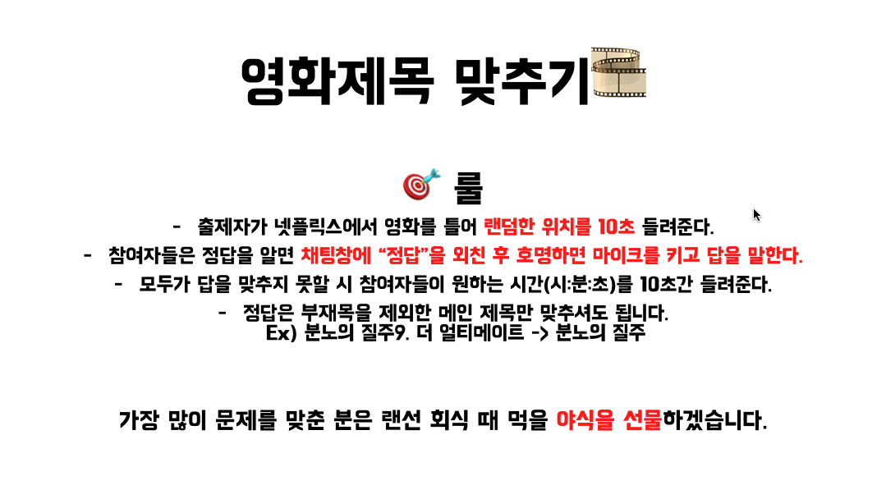
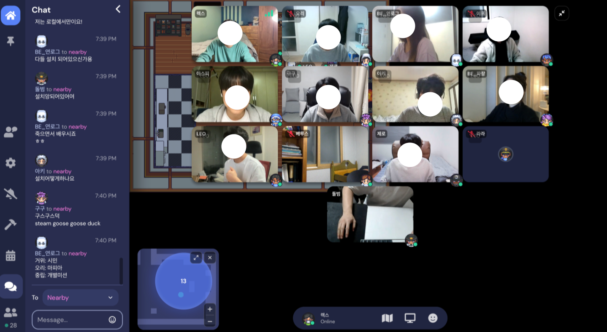
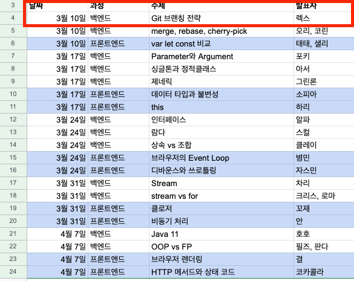

# 미션진행

이번에 진행한 로또 미션은 새로운 페어인 `써머`와 함께했습니다.
그리고 이전 `스컬`과 미션을 진행했던 것처럼 이번 미션 또한 `써머`와 직접 만나서 진행을 해봤습니다😁

미션을 진행해보니 확실히 지난 자동차 미션보다는 난의도가 올라갔더군요😭
이번 미션에는 지난번 미션에서 아래의 새로운 추가 요구사항이 생겼어요.

- Java Enum을 적용한다.
- 모든 원시 값과 문자열을 포장한다
- 일급 컬렉션을 쓴다.

지난번 자동차 경주 미션과 프리코스때도 Enum과 일급 컬렉션은 사용을 하였어서 크게 문제가 없었으나,
`모든 원시 값과 문자열을 포장한다.`의 추가사항은 처음 접해본 요구사항이어서 어려움을 느꼈습니다.
원시 값을 포장하는 것에 대해 `써머`와 함께 이론에 대해 학습하고 미션을 진행하였음에도 불구하고 둘 다 처음 사용해봐서..
역시나 원시 값 포장에 대한 이점을 살리지 못하였습니다.

또한 지난 미션의 주된 목적이 TDD의 학습이었다면 이번 목적의 주된 목적은 OOP였는데..해당 내용들도 처음에는 살리지 못하였습니다.

하지만 리뷰어 `코니`의 리뷰를 하나씩 받으며 코드를 수정하다보니 원시 값 포장의 이점도 살리고, 객체들을 나누고 객체들의 작업 분리를 하며
미션이 끝날 때에는 처음보다 훨씬 OOP에 가까운 코드가 되어있었습니다.

앗..그리고 저는 이번 미션에서 OOP보다 더 어려움을 느꼈던 것은 클래스와 변수들의 네이밍이었습니다..
`LottoNumber`, `Lotto`, `Lottos`, `WinningNumbers` 등 개발을 진행할 떄 비슷한 이름의 클래스들이 너무 많아 개발을 하며 너무 헷갈렸어요..
제가 작성한 코드인데 개발 도중에도 헷갈리다니...정말 좋지 않은 네이밍이었던 것 같습니다..
그래서 그런지 `코니`에게도 네이밍에 관한 지적을 많이 받았던거 같아요😭

자세한 코드리뷰와 작성 코드는 아래의 링크에서 확인해보실 수 있습니다.

> - [[1단계 - 로또(자동)] 렉스(오성원) 미션 제출합니다. #390](https://github.com/woowacourse/java-lotto/pull/390)
> - [[[2단계 - 로또(자동)] 렉스(오성원) 미션 제출합니다. #471]](https://github.com/woowacourse/java-lotto/pull/471)
> - [우아한테크코스 - 레벨1 로또 미션 피드백 정리](https://seongwon97.github.io/posts/%EC%9A%B0%ED%85%8C%EC%BD%94-%EB%A0%88%EB%B2%A81-%EB%A1%9C%EB%98%90-%ED%94%BC%EB%93%9C%EB%B0%B1%EC%A0%95%EB%A6%AC/)

# 데일리 준비

아침마다 진행하는 `구구`와 함께하는 데일리 미팅에서는 우테코 시작 셋째주부터
그 날의 데일리 미팅을 진행하는 사회자(`마스터`)를 뽑아 진행을 하였습니다.

주제는 다양하게 맛집 소개, 게임으로부터 시작하여, 앞으로 만들어보고싶은 프로젝트 소개 등 다양한 주제로 이야기를 하였습니다.
그렇게 마스터의 순서가 돌고 돌아 저의 차례가 왔습니다.

저는 롯데시네마 드리미 출신인 만큼, 영화와 관련된 주제를 진행하였습니다👍🏻
선정한 주제는 바로~~~`소리를 듣고 영화 제목 맞추기`였습니다.

하지만 데일리 마스터를 위해 주제 선정과 준비를 열심히 하였으나..
넷플릭스의 보안 문제떄문에 줌으로 화면 공유를 하게되면 화면이 검게 나오는 점이 아쉬웠어요..

원래 이런 문제들은 소리를 듣고 참가자가 제목을 맞추면 해당 장면을 보여줘야하는데 말이죠😭

그래서 결국에는 게임하는 중간에 넷플이 아닌 유튜브로 플랫폼을 바꿔..제가 하나씩 검색하며 문제를 출제하고 화면 공유를 했습니다.😭

다음번에는 이런 게임을 준비한다면 더욱 확실하게 준비해봐야겠어요..

# 랜선회식

글을 올리는 3월 7일인 오늘은 데일리 미팅 조의 랜선회식을 해봤어요!
다른 조들이 랜선 회식을 하는건 자주 봤었는데, 제가 직접 해보려니까 뭔가 어색하기도 하면서 재밋기도 하네요😁

제가 원래 밖에서 사람들이랑 친화력은 좋아도..이렇게 랜선에서 화상으로 친해지는건 아직 어색한 사람이라..랜선 회식을 했다는게 아쉽네요ㅠ
다들 직접 만나서 이야기를 했으면 더 많은 이야기를 했을텐데..코로나가 좀 괜찮아지면 오프라인 회식도 기대해봐야겠어요👍🏻

# 테코톡준비

우테코에서는 과정이 끝나기 전에 최소 한번 이상 테코톡 발표를 해야지 수료를 할 수 있습니다.

저는 시간이 흘러 우테코 레벨이 높아질수록 공부할 시간도 부족할 것 같아..매도 빨리 맞자!!는 생각으로 신청 지원이 열리자마자
바로 `Git branch전략`에 대한 발표 신청을 하였습니다.

그 결과...우테코 4기의 테코톡 발표 스타트를 제가 끊게 되었습니다..
3월 10일 첫 발표라니🤯

유튜브에 박제되는 만큼..열심히 준비해야겠어요🤯

# 마치며..

이렇게 두번째 미션기간도 끝이 났네요😁

다음 미션도 열심히해서 많은 것을 배우는 2주가 되었으면 좋겠네요~
다들 화이팅입니다🔥
